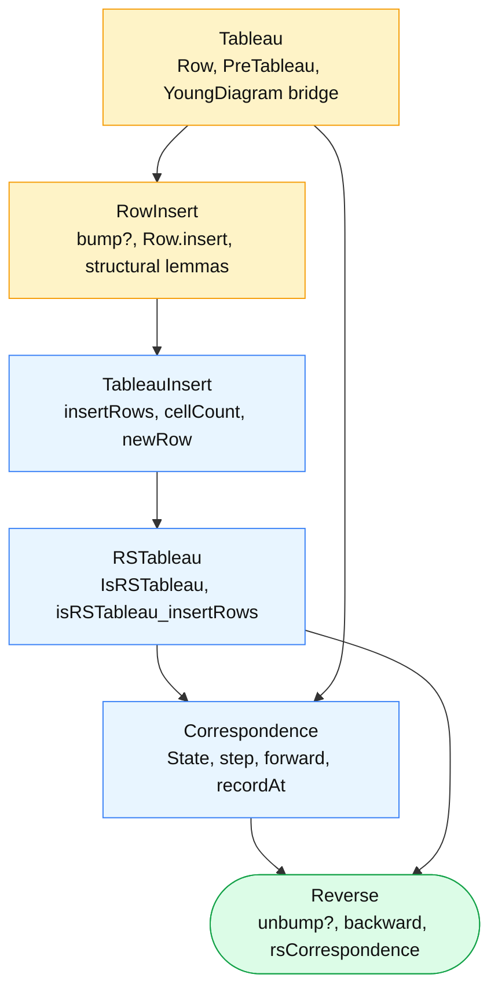

# robinson_schensted

A Lean 4 + mathlib formalization of the Robinson-Schensted correspondence on
permutations: each list of distinct natural numbers corresponds bijectively
to a pair of standard Young tableaux of the same shape, via row insertion
and recording.

## The headline

Two `Equiv`s exported from `RS/Reverse.lean`:

```lean
noncomputable def rsCorrespondence :
  {w : List ℕ // w.Nodup} ≃ {s : State // IsForwardImage s}

noncomputable def rsStandardCorrespondence (n : ℕ) :
  {w : List ℕ // List.Perm w (revLabelsFrom 1 n)} ≃ {s : State // IsStandardState n s}
```

`State` bundles the insertion tableau `P` and recording tableau `Q`. The
first `Equiv` applies to any list of distinct natural numbers; the second
specializes to permutations of `1..n`, encoded as words permuting
`revLabelsFrom 1 n = [n, n-1, …, 1]`.

The `noncomputable` is a packaging artifact — the inverse direction extracts
its witness through `Classical.choose` over a uniqueness lemma, but the
underlying `backward` algorithm is itself fully computable.

## Module structure



Bottom-up:

| Module | Role |
|---|---|
| `RS/Tableau.lean` | `Row = List ℕ`, `Row.entry`; `PreTableau` (rows, nonempty, row-weak, shape-sorted) plus the `YoungDiagram.ofRowLens` bridge. |
| `RS/RowInsert.lean` | Strictly-increasing rows; `bump?` finds the first entry `≥ x`; `Row.insert` returns the updated row plus an optional bumped value, with the structural lemmas the rest of the development consumes. |
| `RS/TableauInsert.lean` | `insertRows` propagates a bump down a row list, tracking the index of the row where a new box is created; cell count grows by exactly one and the flattened multiset gains exactly the inserted value. |
| `RS/RSTableau.lean` | The full `IsRSTableau` invariant — row-strict, rows nonempty, entries nodup, shape sorted, column-strict — and the preservation theorem `isRSTableau_insertRows`, proved by case analysis on bump-or-not at the current row crossed with bump-or-not at the next row. |
| `RS/Correspondence.lean` | `State {P, Q}`, the per-letter `step`, `forwardAux` and `forward`; the recording-tableau update `recordAt`; end-to-end specs `forward_nodup_spec` and `forward_perm_rs_spec`. |
| `RS/Reverse.lean` | The inverse algorithm — `Row.unbump?` / `popLast?`, `reverseInsertRowsAt`, `unrecordAt`, `stepBack`, `backward` — together with the round-trip `backward_forward` and the two `Equiv` packagings. |

## Representation

Internal representation is `List Row` (where `Row = List ℕ`). All algorithms
and most lemmas operate on this concrete data. The bridge to mathlib's
`YoungDiagram` lives in `PreTableau.youngDiagram`, so shapes can be exported
when needed, but the proofs themselves stay at the list level.

Column-strictness is *not* part of `PreTableau`. It is added in
`RSTableau.lean` where the bumping invariants make it natural to state and
prove, which keeps the foundational `PreTableau` API minimal.

## What's not here yet

- Biwords / generalized RSK. The current development is RS on permutations.
- A computable wrapper for the two `Equiv`s. `backward` is computable;
  only the `Equiv` packaging routes through `Classical.choose`.
- The `SemistandardYoungTableau` export layer. `State` is a list-of-rows
  pair; converting to a pair of mathlib `StandardYoungTableau` (or a
  locally-defined wrapper, since mathlib does not yet have a native
  `StandardYoungTableau` type) is a follow-up.
- The standard corollaries: length of longest increasing subsequence equals
  length of the first row of `P`; longest decreasing equals the first
  column; Schensted's theorem.

## Build

```bash
lake build
```

The project depends on mathlib `v4.30.0-rc2` and pins Lean `v4.30.0-rc2`.
Zero `sorry`, zero `axiom`.
