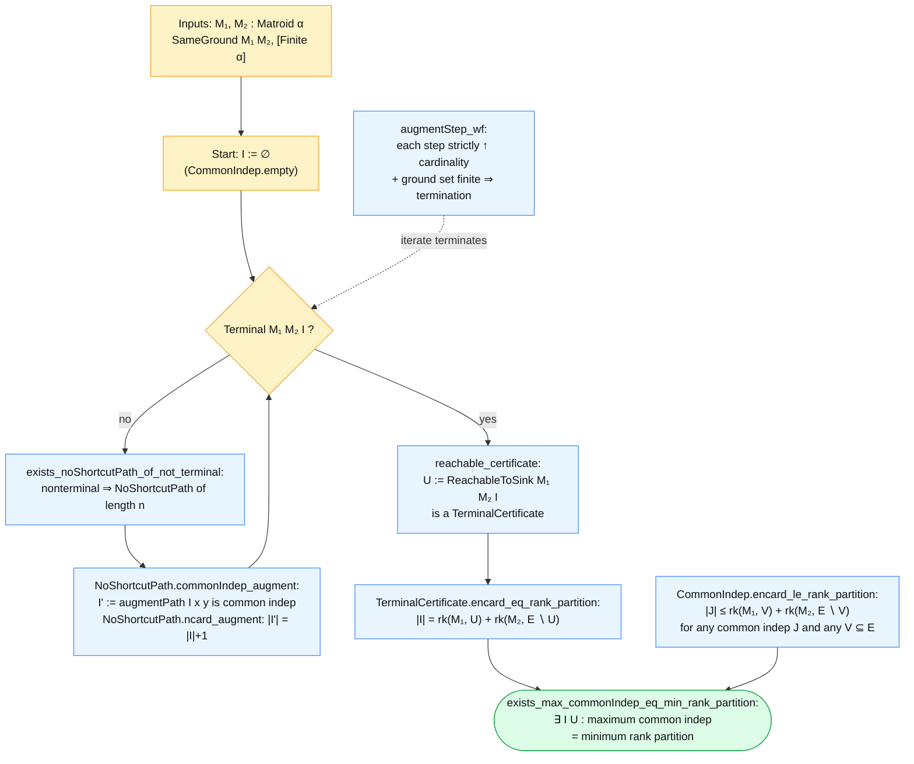

# matroid_intersection

A Lean 4 development of the **matroid intersection min-max theorem** via the Edmonds-style
augmenting-path argument, plus an algorithm-correctness layer parameterized by an abstract
search procedure.

The headline theorem (`Matroid.exists_max_commonIndep_eq_min_rank_partition`):

> For two matroids `M₁`, `M₂` on the same finite ground set `E`, the maximum size of a
> common independent set equals the minimum value of `rk M₁ U + rk M₂ (E ∖ U)` over `U ⊆ E`,
> with explicit witnesses `(I, U)`.

## Proof flow



## Module structure

The development is split into a **theorem layer** (`Matroid.Intersection.*`) that proves the
min-max theorem, and an **algorithm layer** (`Matroid.Edmonds.*`) that parameterizes the proof
by an abstract search procedure.


| Module | What it contains |
|---|---|
| `Matroid.CommonIndep` | top-level `CommonIndep`, `CommonIndep.empty`, `CommonIndep.encard_le_rank_partition` |
| `Matroid.Intersection.ExchangeGraph` | exchange graph, `IndepExtension`/`SourceSet`/`SinkSet`, `Terminal`, `TerminalCertificate` |
| `Matroid.Intersection.AugmentingPath` | `SimpleAugPath` and the minimality / splice machinery |
| `Matroid.Intersection.NoShortcutPath` | `NoShortcutPath`, `AugmentStep`, `Run`, terminal iff, common-indep preservation |
| `Matroid.Intersection.Optimality` | `augmentStep_wf`, `optimal_of_certificate`, `exists_optimal_terminal_run`, `TerminalCertificate.encard_eq_rank_partition` |
| `Matroid.Intersection` | umbrella + `exists_max_commonIndep_eq_min_rank_partition` |
| `Matroid.Edmonds.Search` | `SearchSpec` interface; noncomputable `classical` witness |
| `Matroid.Edmonds.Algorithm` | `SearchSpec.iterate` + correctness theorems; algorithmic min-max |

## Out of scope

- A computable BFS-style `SearchSpec` instance — would require a decidability story for
  `M.Indep` (e.g. `DecMatroid`) and `Finset`-based augmentation; tracked as Layer 3.
- Polynomial-time complexity analysis of the iteration.

## References

- mathlib matroid API:
  https://leanprover-community.github.io/mathlib4_docs/Mathlib/Combinatorics/Matroid/Basic.html
- Goemans lecture notes on matroid intersection:
  https://math.mit.edu/~goemans/18438F09/lec11.pdf
- Cole Franks lecture notes:
  https://colefranks.github.io/18453/lecturenotes/6-matroid-intersect-notes.pdf
- blog proof outline used to shape the toy formalization:
  https://ainta.github.io/2019-06-17-Matroid-Intersection

## Build

```bash
cd combinatoric_optimization/matroid_intersection
lake build
```
